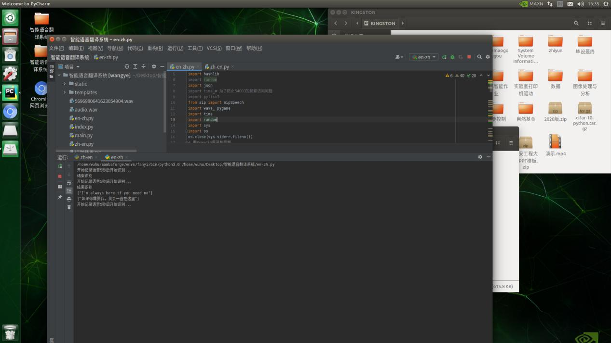

# 实时在线语音翻译系统(Real-time online voice translation system)

## 简介: 
本项目实现了一套快速有效的语音中英翻译系统，该系统可实现高精度的语音识别、高效双语翻译以及精准的语音合成，可应用于实时翻译场景。系统预先要求用户设置翻译模式，当用户说话时系统进行自动识别及实时翻译，最终，输出语音翻译结果。

该系统提供实时翻译，便于携带。在得到准确高效翻译的同时也节省了人工翻译的成本，无需文字写入读取语音即 可翻译，实现了市场翻译软件的低成本，同时为用户提供多样性的体验模式
## 页面


本项目调用了百度翻译接口，实现高精度 的语音识别、高效双语翻译以及精准的语音合成。
```
""" 你的 APPID AK SK """
APP_ID = ''
API_KEY = ''
SECRET_KEY = ''

```
## 功能
### 1.中文→英文实时语音文字翻译
### 2.英文→中文实时语音文字翻译


## 翻译结果

